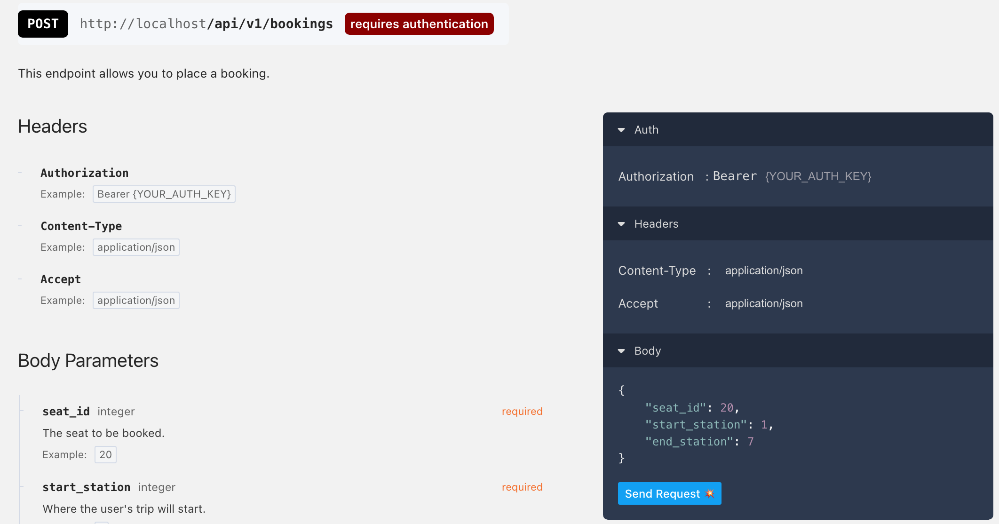

# Overview

Bus booking API built using Laravel 10. This API is built for the purposes of a technical assessment.

The repository is built for the code to be easily assessed, the assumption is that this is a project
with certain milestones, for each milestone, there would usually be multiple tickets. Each branch is 
intended to act as a ticket deliverable, and should demonstrate best practices such as atomic commits 
and proper feature blending.

For example:
- `wa-[ticket-number]-[ticket-description]` - where `wa` stands for my initials, and `ticket-number` is the ticket number (but in the absence of one then I just used the description)

Each branch will have a corresponding PR that you can review for code changes done at that point during development progress.

For code styling and ensuring consistency across the codebase, [Laravel Pint](https://laravel.com/docs/10.x/pint) is utilized.
See [pint.json](pint.json) for the configuration used.

## Installation

### Prerequisites
- PHP 8.0
- Composer
- MySQL 8.0

### Steps
1. Clone the repository
2. Run `composer install`
3. Create a copy of `.env.example` and rename it to `.env`. Add your database credentials.
4. `php artisan key:generate` (optional)
5. `php artisan migrate`
6. `php artisan db:seed`. Since it was requested to provide a DB dump, you can elect to skip this step.
7. `php artisan serve` or use your preferred web server. This project was built using Valet.

### Usage

1. Obtain an access token by sending a `POST` request to `/api/login` with the following payload (if you ran the seeder, then you can pull an e-mail out of the `users` table, otherwise there's a user already provided in the database dump)
    ```json
    {
        "email": "test-user@robusta.com", 
        "password": "password"
    }
    ```
2. Use the access token to make requests to the API. You can use the `Authorization` header with the value `Bearer <access_token>`.
3. You can get a list of available seats from point A to point B by sending a `POST` request to `/api/v1/seats/available` with the following payload (refer to the `trip_stations` table for the station IDs):
    ```json
    {
        "start_station_id": 1,
        "end_station_id": 2
    }
    ```
4. Send a `POST` request to `/api/v1/bookings` to create a booking. The payload should be in the following format:
    ```json
    {
        "seat_id": 1,
        "start_station_id": 1,
        "end_station_id": 2
    }
    ```

## API Documentation

To generate API documentation, run `php artisan scribe:generate`. You can then visit `http://localhost/docs` to view the documentation with a "Try it out" button to directly test 
any of the APIs. Or just use the provided Postman collection.



## How it works

```plaintext
                                   +--------------------------------+
                                   |    User selects start and end  |
                                   |    stations for booking.       |
                                   +--------------------------------+
                                             |
                                             |
                                             V
+------------+  No   +----------------------------------------------------------+
|            |<------|   Does the selected seat have any existing bookings?     |
|  Seat is   |       +----------------------------------------------------------+
| available  |                  |
| for entire |                  | Yes
|   trip     |                  V
+------------+     +----------------------------------------------------------+
                   |   For each existing booking of the selected seat:        |
                   +----------------------------------------------------------+
                                 |
                                 |          
              +------------------|-----------------------+
              |                  |                       |
              V                  V                       |
    +-------------------+  +--------------+   No  +-------------+
    | Does the existing |  | Overlapping  |<------| Does the    |
    |  booking's start  |  | booking is   |       | existing    |
    |  station fall     |  | found! Seat  |       | booking's   |
    |  between the user |  | is not       |       | end         |
    |'s selected start  |  | available.   |       | station     |
    |   and end station?|  +--------------+       | fall        |
    +-------------------+                         | between     |
            | Yes                                 | the user's  |
            |                                     | selected    |
            |                                     | start and   |
            |                                     | end station?|
            |                                     +-------------+
            |                                            | Yes
            V                                            V
    +--------------+                              +--------------+
    | Overlapping  |                              | Overlapping  |
    | booking is   |                              | booking is   |
    | found! Seat  |                              | found! Seat  |
    | is not       |                              | is not       |
    | available.   |                              | available.   |
    +--------------+                              +--------------+
```

The app's core functionality revolves around booking bus seats for trips between stations.

The app exposes 2 main APIs:
- `POST /api/v1/bookings` - to create a booking
- `POST /api/v1/seats/available` - to get a list of available seats

### Objective and Assumptions
The main objective of the API is to allow users to book seats on trips between different stations without overlapping bookings. 
A trip consists of multiple stations ordered by the sequence in which they are visited.

### Challenge
The main challenge is to ensure that a seat is available for booking between two specific stations. 
This becomes complicated because one seat might be booked for a segment of the trip, but it could be available for other segments.

### Structure

#### Trips and Stations:

- A trip has multiple stations in a sequence, defined by the order.
- Every station in a trip is uniquely identifiable by its order.

#### Seat Availability:

- A seat is considered available if it is not already booked between the user's desired start and end stations.
- A seat might be booked for station 1 to station 3, but it could be available for station 4 to station 5.

#### Overlapping Check:

- For a seat to be available, it should not have an overlapping booking.
- Existing booking's start station is between the user's start and end station.
- Existing booking's end station is between the user's start and end station.

Here's the basic pseudocode to describe how this check is performed:
    
```
FUNCTION isBookingOverlapping(booking, trip, startStation, endStation)
    FIND order for startStation in trip (startOrder)
    FIND order for endStation in trip (endOrder)
    FIND order for booking's start station in trip (bookedStartOrder)
    FIND order for booking's end station in trip (bookedEndOrder)

    IF bookedEndOrder <= startOrder OR bookedStartOrder >= endOrder
        RETURN false
    ELSE
        RETURN true
    END IF
END FUNCTION
```

## Testing

`composer test`

## Credits
- [Wessam Ahmed](mailto:wessam.ah@outlook.com)
